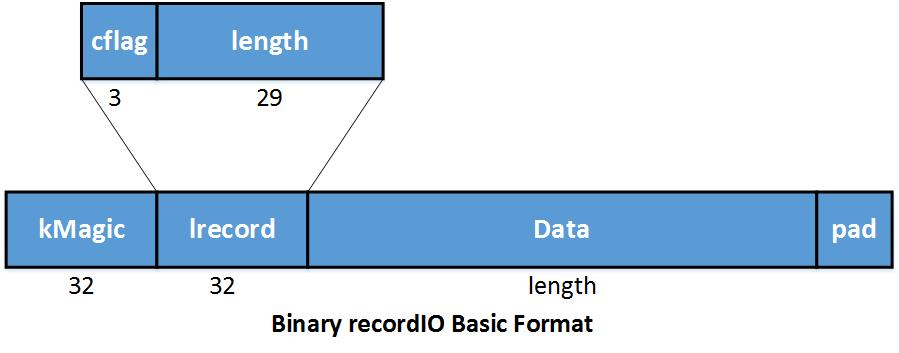
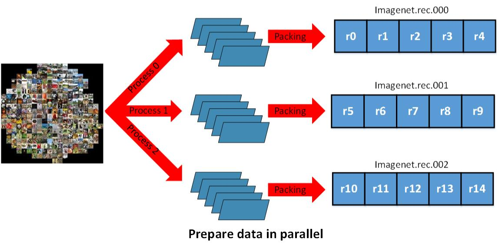

# Overview

this doc will focus on **Data Loading(IO)** part.

## Design Insight
一个IO系统包含两个部分：data preparation和data loading。数据准备通常是离线做的，而数据读入则会影响实时的性能。
### Data Preparation
数据准备是指将数据打包成想要的形式，用于之后的处理。对像imagenet这样的大型数据库进行数据准备，过程会很耗时，这时候我们需要考虑以下几点： 
  
- 将数据集打包成几个文件。一个数据集可能包含几百万的数据，将数据打包成几份能够方便地用于分布式。    
- 一次性打包。我们不希望每次更改一下run-time settings，比如使用机器的数目改变了，就需要重新进行打包。    
- 打包过程并行执行来节省时间。
- 能够容易地获取数据的任意部分。这对于分布式机器学习进行数据并行非常重要。理想的行为是：不管数据在物理上被打包成了多少份，它们在逻辑上能够被拆分成任意份。比如：我们将1000张图片打包成4个物理文件，那么每个文件包含250张图片。如果我们使用10台机器来训练一个DNN,那么我们需要在每台机器上load 100张图片。另外，有些机器可能需要从不同的物理文件中读取图片。   

### Data Loading
下一步需要考虑的是如何把打包的数据load到RAM里。我们的目标是读取数据越快越好。需要考虑以下几点：

- 读取的连续性：如果数据存在磁盘上的连续位置，我们可以读的更快。   
- 减少要读入的字节数：我们可以通过将数据保存成简洁的方式来实现这一点，比如把图片保存成JPEG格式。
- 读取和训练在不同的线程中进行：这样可以避免在读取数据的时候出现计算瓶颈。
- 节省RAM：明智地决定是否需要把所有的文件都读入RAM中。

## Data Format
由于训练DNN通常需要大量的数据，因此我们选择的数据格式应该是高效而简便的。为了实现这一点，我们需要将二值的数据打包成可拆分的形式。在MXNet中我们使用dmlc-core中实现的binary recordIO作为数据的主要格式。

### Binary Record



在MXNet的binary RecordIO中，我们将每个数据实例保存成一条记录。    
1. kMagic是一个魔数表示一条记录的起始位置。
> 魔数：很多类型的文件，其起始的几个字节的内容是固定的（或是有意填充，或是本就如此）。根据这几个字节的内容就可以确定文件类型，因此这几个字节的内容被称为魔数（magic number）。

2.Lrecord记录了长度和一个连续的flag。在Lrecord中， 
   
- cflag == 0:这是一条完整的记录     
- cflag == 1:这是多条记录的起始         
- cflag == 2:这是多条记录的中间位置     
- cflag == 3:这是多条记录的结尾    

3.Data是用来保存数据内容的空间。    
4.Pad是一个pad区域用来保证每条记录对齐到4个字节。

当我们打包了数据之后，每个文件就包含多条记录。然后，读取就可以是连续的了。这将避免读取磁盘上任意位置导致的低性能。   
通过记录来存储数据的一个优点在于每一条记录可以是不定长的。这可以使我们在保存数据上比较简洁，特别是在有好的压缩算法的时候，比如说，我们用JPEG来保存图片数据，那么这个打包的数据会比直接存储未经过压缩的像素的RGB值要小的多。    
以ImageNet_1K数据集为例。加入我们存储的数据是3\*256\*256的一个RGB值的矩阵，那么整个数据集将达到200G多。而如果我们使用JPEG对普片进行压缩，它们只需要在磁盘空间上占用35G左右。这将极大地减少从磁盘读入数据的时间。     
下图是一个binary recordIO的例子。我们首先将图片resize到256\*256，然后压缩成JPEG的形式。之后我们为图片增加一个header用来指示这张图片的index和label，然后存储在记录的Data区域。然后我们将几张图片一起打包成一个文件。 


### Access Arbitrary Parts Of Data
data loader的一个比较理想的属性是：打包好的数据可以在逻辑上被切成任意份，不管在物理上数据被打包成了多少份。由于binary recordIO可以利用魔数容易地定位到一条记录的头和尾的位置，因此我们可以利用dmlc-core中提供的InputSplit函数实现上述目标。     
InputSplit需要以下参数：

- FileSystem *filesys*：不同文件系统如hdfs,s3,local等的IO操作的dmlc-core wrapper。用户不应该担心不同文件系统的差别。
- Char *uri*：文件的URI。注意这可能是文件的列表，因为我们会把文件打包成多份，文件URIs通过“；”分割。
- Unsigned *nsplit*：逻辑分割的数目。*nsplit*可以和物理文件的数目不同。
- Unsigned *rank*：哪个split要加载进当前进程。

逻辑分割的过程如下：    

- 确定每一份的大小


- 根据文件大小将record大致分成指定份。注意每份的边界可能位于某条record的中间。


- 调整每一份的起始位置，保证一条记录不会被分到不同的partition中。


通过上述操作，我们现在能够知道哪条记录属于哪个部分，哪个部分需要哪个物理数据文件。InputSplit很大程度上简化了数据并行，这样每个process只需要读取部分的数据即可。    
由于我们的分割不是依赖于物理文件的个数的，因此我们可以以并行的方式处理像ImageNet_22k这样大型的数据库，如下图所示。我们不再需要在准备数据的时候考虑分布式读取的事情，只需要根据数据集的大小和计算资源的多少选择合适的物理文件数目。


## 数据读取和预处理
当数据的读取和预处理的速度跟不上训练／评估的速度时，IO可能成为整个系统的速度瓶颈。在这一章节中，我们将介绍一些tricks来实现更加高效地读取和预处理binary recordIO形式的数据。当在ImageNet数据集上使用的时候，我们的方法在一个HDD上实现了3000张图／秒的IO速度。
### Loading and preprocessing on the fly
当训练DNN时，我们有时候必须在训练的同时读取和预处理数据，这是因为：

- 当数据集的大小超过了可用的RAM大小时，我们不能事先完成读取
- 有时候为了使模型对平移／旋转／颜色变化等变换鲁棒，我们在训练的过程中会加入一些随机因素。这时候我们就必须在每次使用到每张图片的时候对它进行重新的预处理。

为了更加高效，我们提出多线程的机制。以Imagenet的训练为例，在读取了一组image records之后，我们开始以多线程的方式同时进行image decoding和image augmentation。这一过程如下图所示：


### Hide IO Cost Using Threadediter
降低IO消耗的一种方式是在一个线程中事先取出下一个batch的数据，同时在主线程中进行训练的前向和反向过程。为了支持更佳复杂的训练场景，MXNet利用dmlc-core中的threadediter来提供一个普适性的IO处理流程。threadediter的关键在于开启一个独立的线程用于提供数据，同时主线程则作为数据的使用方，如下图所示。    
threadediter保持一个固定大小的buffer，当buffer不满的时候自动填充它。并且，在buffer中的部分数据被使用后，threadediter会重新利用这部分空间来保存数据的下一部分。


### MXNet IO Python Interface
我们将IO对象表示成numpy中的iterator的形式。这样，使用者可以通过for训练或者next()函数来容易地读取数据，在MXNet中定义一个data iterator和定义一个symbolic operator一样简单。     
以下示例代码定义了一个Cifar数据循环器。

```
dataiter = mx.io.ImageRecordIter(
    # Dataset Parameter, indicating the data file, please check the data is already there
    path_imgrec="data/cifar/train.rec",
    # Dataset Parameter, indicating the image size after preprocessing
    data_shape=(3,28,28),
    # Batch Parameter, tells how many images in a batch
    batch_size=100,
    # Augmentation Parameter, when offers mean_img, each image will subtract the mean value at each pixel
    mean_img="data/cifar/cifar10_mean.bin",
    # Augmentation Parameter, randomly crop a patch of the data_shape from the original image
    rand_crop=True,
    # Augmentation Parameter, randomly mirror the image horizontally
    rand_mirror=True,
    # Augmentation Parameter, randomly shuffle the data
    shuffle=False,
    # Backend Parameter, preprocessing thread number
    preprocess_threads=4,
    # Backend Parameter, prefetch buffer size
    prefetch_buffer=1)
```
通常情况下，创建一个数据循环器需要提供以下5组参数：

- Dataset Param：读取数据集需要的信息，例如文件路径／输入大小等。
- Batch Param：确定如何组织batch，例如batch的大小。
- Augmentation Param：对一张输入图片采取哪些数据放大的操作，如crop，mirror等。
- Backend Param：控制后端线程的行为来隐藏数据读取的消耗。
- Auxiliary Param：提供一些帮助debug的选项。

通常Dataset Param和Batch Param是必须提供的，否则data batch无法创建。其他参数可以根据需要提供。理想情况下，我们应该将MX Data IO拆分成modules，其中一些开发给使用者可能有用，比如说：

- 高效的prefetcher：允许使用者写一个data loader来读取他们自定义的二值形式，并且可以自动得到多线程prefetcher的支持
- data transformer：图像随机裁剪／镜像等。允许使用者使用这些工具，或者引入他们自定义的transformer。

