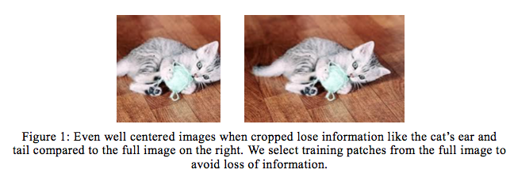
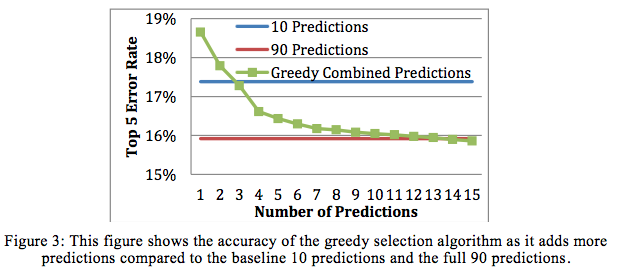

## Data augmentation：
1. 图片patch的随机采样，参考文献【1】
2. 图片的对比度、亮度、颜色的变化，参考文献【2】
3. 图片的光照变化，参考文献【3】

**相关文献:**  
【1】SSD: Single Shot MultiBox Detector  
【2】Some Improvements on Deep Convolutional Neural Network Based Image Classification  
【3】ImageNet Classification with Deep Convolutional Neural Networks 
具体文献中的data augmentation详见附录。
___

## Data augmentation实现：
目前实现的data augmentation为上述3点中的第2点。 
具体实现逻辑为：  
  
可以看出不管是 train\_end2end 还是train\_alternate中train\_rpn/train\_rcnn都需要通过get\_image获取图片，因此在这个位置对图片进行data augmentation.   
加入如下代码用于对图片进行转换：  
 
```
def img_transform(im, roidb):
    # convert cv2 image to PIL image
    PIL_image = Image.fromarray(cv2.cvtColor(im, cv2.COLOR_BGR2RGB))
    # sample a type of image enhancement to implement
    color_transform_rand = random.random()
    if color_transform_rand < 0.25:
        # change contrast
        img_enhancement = ImageEnhance.Contrast(PIL_image)
    elif color_transform_rand < 0.5:
        # change brightness
        img_enhancement = ImageEnhance.Brightness(PIL_image)
    elif color_transform_rand < 0.75:
        # change color
        img_enhancement = ImageEnhance.Color(PIL_image)
    else:
        # change sharpness
        img_enhancement = ImageEnhance.Sharpness(PIL_image)

    enhance_factor = random.uniform(0.5, 1.5)
    new_image = img_enhancement.enhance(enhance_factor)
    #convert PIL image back to cv2 image
    cv2_image = cv2.cvtColor(np.array(new_image), cv2.COLOR_RGB2BGR)

    return cv2_image, roidb
```

然后在 [get_image(roidb)](https://github.com/ElaineBao/mxnet/blob/dev/example/rcnn/rcnn/io/image.py#L8) 中调用img\_transform即可。


## 附录
### 1. 文献【1】中的Data augmentation:
每张图片通过以下方式之一进行随机采样：   
1. 使用原始的整张图片.   
2. sample一个patch，它和物体的overlap占物体的gt box面积的系数分别为0.1,0.3,0.5,0.7,0.9.  
3. 随机sample一个patch.  

每个sampled patch的面积是原始图像面积的[0.1,1],aspect ratio为[0.5,2]。如果gt box的中心落在sampled patch里面，我们就把overlap的部分加入到gt box里。经过sampling以后，每个sampled patch会被resize到固定大小，并且以0.5的概率进行水平翻转，另外也会进行一些图像的畸变，参考文献【2】。

### 2. 文献【2】中的Data augmentation:
注意，此为分类系统所做的Data augmentation，和检测系统略有不同，可以借鉴其中的部分处理操作。   
分为训练和测试两个部分。  
 
**一、训练时的Data augmentation**.  
在之前的imagenet分类系统中，使用了3种图片转换。   
(1) 对256 * 256的图片随机裁剪224 * 224pixels，来捕获平移不变性。    
(2) 水平翻转图片，来捕获镜像不变性。    
(3) 增加随机产生的lighting来捕获光照变化不变性和少量的颜色不变性。   

在此基础上，我们又另外增加了图像变换的方法来保证平移不变性和颜色不变性。   
(1) 为image crops添加额外的pixels（注：仅适用于分类）.  
之前在文献【3】中，224 * 224的图像crop是通过在一张256 * 256大小的训练图片上裁剪得到的。256 * 256大小的图像则是通过将原来更大的图片的短边rescale到256,然后对长边crop到256. 这种方式没有考虑大概30%的pixel，由此造成了信息的损失。虽然被裁剪舍掉的那些pixels可能相比于图像中间的pixel拥有less的信息，但是我们发现利用这些额外的pixel能够提升模型能力。    

为了使用整张图片，我们首先将图像的短边scale到256，这就给了我们一张N * 256 / 256 * N的图片。然后我们在这上面随机crop一个224 * 224大小作为一张训练图片。这种方式可以增加大量的额外训练数据，帮助网络学习到更多的平移不变性。

(2) 额外的颜色处理.  
除了在文献【3】中使用的随机光噪声，我们也增加了额外的颜色处理。利用python image library(PIL)对图像的对比度、亮度、颜色进行随机修改。这将产生训练样本cover各种图像变化的范围，进而帮助NN学习这些变化的不变性。我们随机选择这三种处理的一种，然后以0.5-1.5的系数进行增强，（1表示图像不变化）。在进行颜色的处理后，我们再增加随机光噪声，类似于文献【3】。
    
**二、测试时的Data augmentation**.  
之前的方法将10种变化（central crop和4个角的crop，以及上述5个的翻转。）的最终结果结合一下来做最终的预测。我们发现用3种不同尺度进行预测有助于提升上述结果。我们还利用了3种不同的平移，来捕获之前直接被crop掉的额外的像素。那么5种transform,2 flip, 3 scales,3 views，一共就有90种变化，这样的话预测速度要慢1个数量级。为了解决这个问题，我们用一个简单的贪婪算法来选择10种变换，效果几乎和90种差不多，使用15种变化稍微更好一点。    
(1) 在不同尺度预测.  
图片的不同尺度包含有用的预测信息，为了得到这些信息，我们在3个不同尺度进行预测。我们使用原始的256，另外加上228、284。注意，当图片进行scale的时候，使用一个好的插值方法很重要，例如bicubic scaling，而不要使用用来给物体做下采样的那些模糊的滤波器。       
(2) 在不同view(平移)下进行预测.   
为了在预测时使用图片的所有像素，我们产生3种不同的view.对于一张256 * N / N * 256的图片，我们产生一个左上、中间、右下3个view的256 * 256的图片，然后再分别进行5种crop,2 flip,3 scale。下图说明3种view是如何构建的。  
      
(3) 减少predictions的数目.    
使用全部的90种predictions将会导致训练速度比10种predictions慢了1个数量级。因此使用简单的贪婪算法对这个数目进行减少。    
算法开始于最好的prediction，在每一个step，再加另一个prediction，直至结果没有额外的提升。这个算法发现前10个predictions和90个的结果差不多，并且发现如果使用15个predictions，比90个predictions要稍微好一些。下图给出了当逐渐加入predictions时精度的变化曲线。这个贪婪算法容易实现，运行速度快，并且没有额外的参数。    
  
<script type="text/javascript" src="http://cdn.mathjax.org/mathjax/latest/MathJax.js?config=default"></script>

### 3. 文献【3】中的Data augmentation:
对图像进行光照强度和颜色的转化：在imagenet training set的RGB pixels上进行PCA。然后对于每张训练图片加入找到的主成分，这样每张RGB图片的pixel就有了如下的变化： 
  


其中pi和lambda\_i是RGB pixel 3 * 3的协方差矩阵的第i个特征向量和特征值， alpha\_i 是高斯分布采样出的随机值。alpha\_i对于一张特定训练图片的所有pixel都是一样的，直到它下次用于训练的时候，alpha\_i会重新生成。